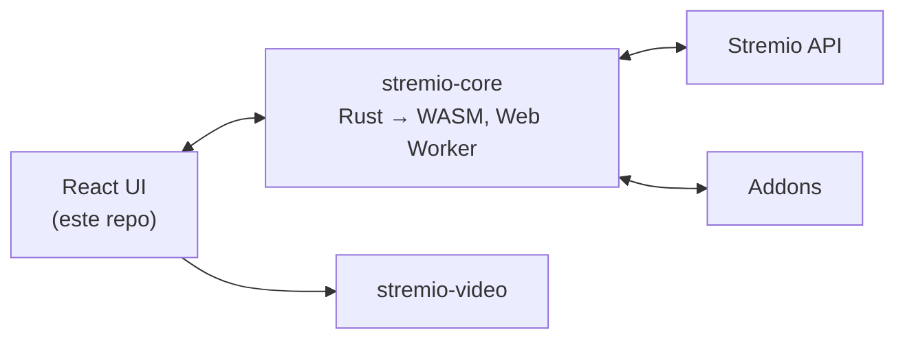

<div align="center">


# Disclaw

Centro de mídia web — descubra, organize e assista, com catálogos vindos de addons.

</div>

> **Sobre este projeto:** Disclaw é um fork de [stremio-web](https://github.com/Stremio/stremio-web) (GPL-2.0), o cliente web oficial do Stremio.
> A marca foi trocada, mas o motor, a API e o protocolo de addons continuam sendo os do Stremio.

## ✨ Recursos

- 🧩 **Movido a addons** — filmes, séries e canais vindos de catálogos de addons
- 🔄 **Sincronização** — biblioteca e "continuar assistindo" seguem a conta entre dispositivos
- 📺 **Cast** — reproduz na TV via Chromecast
- 💬 **Legendas** — de addons ou locais, com estilo customizável
- ⌨️ **Player com teclado** — controle total de reprodução sem mouse
- 🌍 **50+ idiomas** — traduções da comunidade via [stremio-translations](https://github.com/Stremio/stremio-translations)
- 📱 **Instalável** — roda como PWA standalone

## 🛠 Como funciona

A UI (este repo) é um app React, mas o cérebro está no [stremio-core](https://github.com/Stremio/stremio-core) — engine em Rust compilada para WebAssembly rodando em um Web Worker. A UI renderiza o estado, o core calcula. A reprodução passa pelo [stremio-video](https://github.com/Stremio/stremio-video), que escolhe a implementação de player adequada ao ambiente.



## 🚀 Começando

Requer [Node.js](https://nodejs.org) 22+ e [pnpm](https://pnpm.io/installation) 11+.

```bash
pnpm install
pnpm start
```

O dev server sobe em `http://localhost:8080`.

| Comando | Descrição |
|---|---|
| `pnpm start` | Servidor de desenvolvimento com hot reload |
| `pnpm run start-prod` | Servidor de desenvolvimento em modo produção |
| `pnpm run build` | Build de produção |
| `pnpm test` | Roda os testes |
| `pnpm run lint` | Lint do código |
| `pnpm run scan-translations` | Procura chaves de tradução faltando |

### 🐳 Docker

```bash
docker build -t disclaw .
docker run -p 8080:8080 disclaw
```

## 🎨 Marca

A identidade é a letra **D** cortada por três garras, em verde. As fontes são vetoriais e ficam em `assets/brand/`:

| Fonte | Gera |
|---|---|
| `assets/brand/symbol.svg` | `assets/images/disclaw_symbol.png`, `icon*.png`, `assets/favicons/*.ico` |
| `assets/brand/maskable.svg` | `assets/images/maskable_icon*.png` (fundo cheio + safe zone do PWA) |
| `assets/brand/wordmark.html` | `assets/images/logo.png` (símbolo + "disclaw" em Plus Jakarta Sans) |

Depois de editar qualquer fonte, rasterize tudo de novo:

```bash
pnpm run brand
```

O script usa o Chrome como rasterizador (`scripts/render-brand.js`); aponte outro binário com a variável `CHROME` se precisar.

### Cores

| Token | Valor | Onde |
|---|---|---|
| Verde da marca | `#1DD176` | `--primary-accent-color` em `src/App/styles.less`, gradiente do símbolo |
| Verde claro | `#5CF29A` | topo do gradiente do símbolo |
| Verde escuro | `#0A8F4E` | base do gradiente do símbolo |
| Fundo secundário | `rgba(10, 44, 31, 1)` | gradiente do app |
| Tema do PWA | `#0F4630` / `#08130E` | `theme_color` / `background_color` no `manifest.json` |

Os fundos da tela de login (`assets/images/background_1.svg`, `background_2.svg`) também foram recoloridos para verde.

### Texto da marca

O nome do produto nas strings vem do pacote `stremio-translations` e é reescrito em runtime por `src/common/brand.js` — mude `APP_NAME` ali e a interface inteira acompanha. Strings sem a palavra "Stremio" (como o slogan "Liberdade para o Stream") não são afetadas e precisam ser trocadas à mão.

## 📄 Licença

Fork de stremio-web. Copyright © 2017-2026 Smart Code OOD. Distribuído sob a licença GPL-2.0 — veja [LICENSE](/LICENSE.md).
