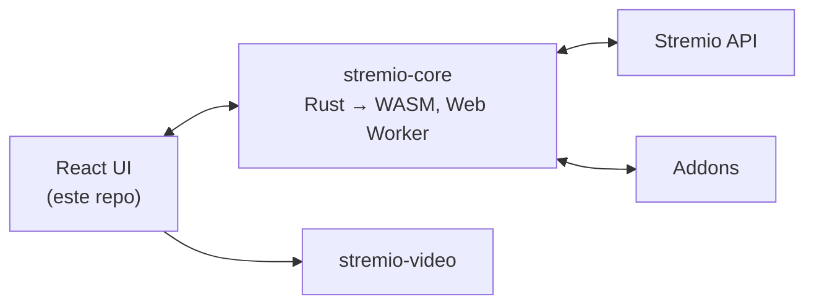

<div align="center">


# Disclaw

Centro de mídia web — descubra, organize e assista, com catálogos vindos de addons.

</div>

> **Sobre este projeto:** Disclaw é um fork de [stremio-web](https://github.com/Stremio/stremio-web) (GPL-2.0), o cliente web oficial do Stremio.
> A marca foi trocada, mas o motor, a API e o protocolo de addons continuam sendo os do Stremio.

## ✨ Recursos

- 🧩 **Movido a addons** — filmes, séries e canais vindos de catálogos de addons
- 🔄 **Sincronização** — biblioteca e "continuar assistindo" seguem a conta entre dispositivos
- 📺 **Cast** — reproduz na TV via Chromecast
- 💬 **Legendas** — de addons ou locais, com estilo customizável
- ⌨️ **Player com teclado** — controle total de reprodução sem mouse
- 🌍 **50+ idiomas** — traduções da comunidade via [stremio-translations](https://github.com/Stremio/stremio-translations)
- 📱 **Instalável** — roda como PWA standalone

## 🛠 Como funciona

A UI (este repo) é um app React, mas o cérebro está no [stremio-core](https://github.com/Stremio/stremio-core) — engine em Rust compilada para WebAssembly rodando em um Web Worker. A UI renderiza o estado, o core calcula. A reprodução passa pelo [stremio-video](https://github.com/Stremio/stremio-video), que escolhe a implementação de player adequada ao ambiente.



## 🚀 Começando

Requer [Node.js](https://nodejs.org) 22+ e [pnpm](https://pnpm.io/installation) 11+.

```bash
pnpm install
pnpm start
```

O dev server sobe em `http://localhost:8080`.

| Comando | Descrição |
|---|---|
| `pnpm start` | Servidor de desenvolvimento com hot reload |
| `pnpm run start-prod` | Servidor de desenvolvimento em modo produção |
| `pnpm run build` | Build de produção |
| `pnpm test` | Roda os testes |
| `pnpm run lint` | Lint do código |
| `pnpm run scan-translations` | Procura chaves de tradução faltando |

### 🐳 Docker

```bash
docker build -t disclaw .
docker run -p 8080:8080 disclaw
```

## 🎨 Personalização da marca

Pontos onde o nome/identidade do Disclaw aparece:

| Onde | O que |
|---|---|
| `package.json` | `name`, `displayName` |
| `manifest.json` | `name`, `short_name`, `description`, cores do tema |
| `src/index.html` | `<title>` e `apple-mobile-web-app-title` |
| `assets/images/disclaw_symbol.png` | Símbolo na navbar, no player (buffering) e na tela de update |
| `assets/images/logo.png` | Logo grande da tela de intro/login |
| `assets/images/icon_*.png`, `maskable_icon_*.png`, `assets/favicons/` | Ícones do PWA e favicon |

## 📄 Licença

Fork de stremio-web. Copyright © 2017-2026 Smart Code OOD. Distribuído sob a licença GPL-2.0 — veja [LICENSE](/LICENSE.md).
